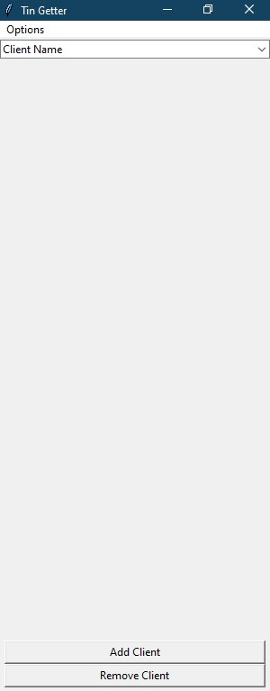
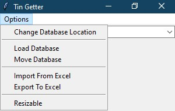
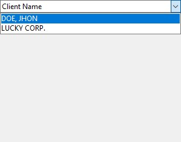
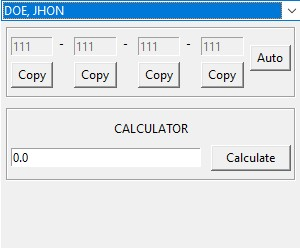
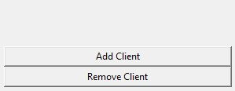
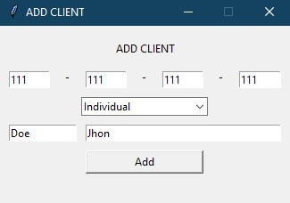
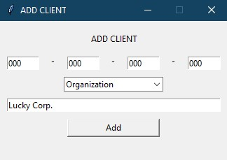
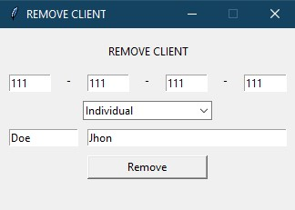
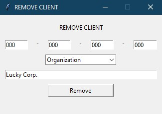

# Tin-Fetcher
A simple application that retrieves Tax Identification Number (TIN) from a database

## Window Structure

This app contains;

* [Main Window](#main-window)
* [Options Menu](#options-menu)
* [Client Dropdown](#client-dropdown)
* [Client Information](#client-information-and-calculator)
* [Calculator](#client-information-and-calculator)
* [Create Client](#create-window)
* [Remove Client](#remove-window)
### Main Window

### Options Menu

* **Change Database Location**

     Lets the user choose where the database is located.
     
* **Load Database**

     Lets the user choose which database to use.
     
* **Move Database** *(In Development)*
* **Import From Excel** *(In Development)*
* **Export To Excel** *(In Development)*
* **Resizable** *(In Development)*

### Client Dropdown

List of your clients in your database

### Client Information and Calculator

Shows the user the information of a client.
Also contains a **Calculator** *(In Development)*.

### Create and Remove Client

Select a button and it will popup a small window.

### Create Window 
Add a client with the exact Tax Identification Number (TIN) to the Database

##### Individual
 

##### Organization
 

 

### Remove Window

Remove a client with the exact Tax Identification Number (TIN) from the Database

##### Individual
 

##### Organization
 
